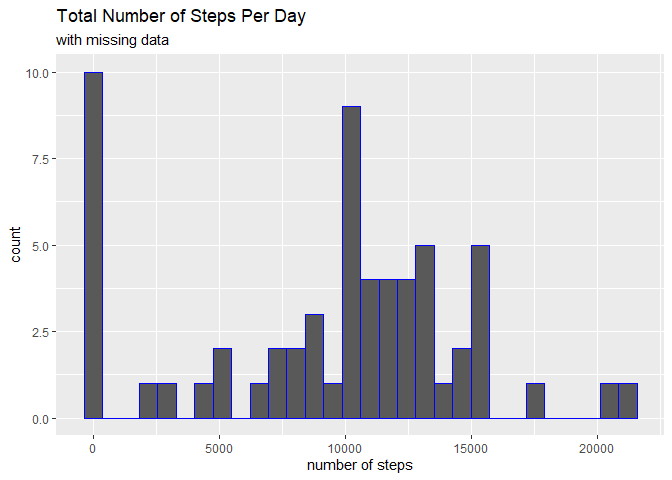

## Loading and preprocessing the data

```r
library(tidyverse)
```

```
## Warning: package 'tidyverse' was built under R version 4.2.2
```

```
## ── Attaching packages ─────────────────────────────────────── tidyverse 1.3.2 ──
## ✔ ggplot2 3.4.1     ✔ purrr   1.0.1
## ✔ tibble  3.1.8     ✔ dplyr   1.1.0
## ✔ tidyr   1.3.0     ✔ stringr 1.5.0
## ✔ readr   2.1.4     ✔ forcats 1.0.0
```

```
## Warning: package 'ggplot2' was built under R version 4.2.2
```

```
## Warning: package 'tibble' was built under R version 4.2.2
```

```
## Warning: package 'tidyr' was built under R version 4.2.2
```

```
## Warning: package 'readr' was built under R version 4.2.2
```

```
## Warning: package 'purrr' was built under R version 4.2.2
```

```
## Warning: package 'dplyr' was built under R version 4.2.2
```

```
## Warning: package 'forcats' was built under R version 4.2.2
```

```
## ── Conflicts ────────────────────────────────────────── tidyverse_conflicts() ──
## ✖ dplyr::filter() masks stats::filter()
## ✖ dplyr::lag()    masks stats::lag()
```

```r
library(xtable)
```

```
## Warning: package 'xtable' was built under R version 4.2.2
```

```r
activ_monit_dat <- read_csv("./activity/activity.csv", na = "NA")
```

```
## Rows: 17568 Columns: 3
## ── Column specification ────────────────────────────────────────────────────────
## Delimiter: ","
## dbl  (2): steps, interval
## date (1): date
## 
## ℹ Use `spec()` to retrieve the full column specification for this data.
## ℹ Specify the column types or set `show_col_types = FALSE` to quiet this message.
```


## What is mean total number of steps taken per day?

```r
steps_per_day <- activ_monit_dat %>% 
  group_by(date) %>% 
  summarise(steps_day = sum(steps,na.rm = T))
```

#### *Total Steps per day:*


```r
steps_per_day
```

```
## # A tibble: 61 × 2
##    date       steps_day
##    <date>         <dbl>
##  1 2012-10-01         0
##  2 2012-10-02       126
##  3 2012-10-03     11352
##  4 2012-10-04     12116
##  5 2012-10-05     13294
##  6 2012-10-06     15420
##  7 2012-10-07     11015
##  8 2012-10-08         0
##  9 2012-10-09     12811
## 10 2012-10-10      9900
## # … with 51 more rows
```


### Histogram of total number of steps per day


```r
p1 <- ggplot(steps_per_day,aes(steps_day)) +
  geom_histogram(color = "blue") +
  labs(title = "Total Number of Steps Per Day",
       subtitle = "with missing data") +
  xlab("number of steps")
  
p1
```

```
## `stat_bin()` using `bins = 30`. Pick better value with `binwidth`.
```

<!-- -->

#### *Median of total number of steps per day*


```r
med_steps <- median(steps_per_day$steps_day)
```

**Median** of total number of steps per day is **10395**

#### *Mean of total number of steps per day*


```r
aver_steps <- mean(steps_per_day$steps_day)
```

**Mean** of total number of steps per day is **9354.2295082**

## What is the average daily activity pattern?


```r
aver_daily_pattern <- activ_monit_dat %>% 
  group_by(interval) %>% 
  summarise(average_steps_per_interval = mean(steps,na.rm=T))
  
ggplot(aver_daily_pattern ,aes(x=interval,y=average_steps_per_interval))+
  geom_line() +
  labs(title = "Average daily Active Pattern") +
  xlab("5 minute interval") + 
  ylab("Average number of steps taken")
```

<!-- -->

```r
max_pat_n_steps <- aver_daily_pattern %>% 
  filter(average_steps_per_interval == max(average_steps_per_interval)) %>% select(interval)
```
The 5-minute interval which contains the maximum number is 835

## Imputing missing values


```r
missing = sum(!complete.cases(activ_monit_dat))
```

Total number of **missing values** in the dataset is **2304**

*replace na values in steps variable by the mean of total steps*
*and store this new complete dataset in activ_complete dataframe*


```r
activ_complete <- activ_monit_dat %>%
  mutate(steps = replace_na(steps,mean(steps,na.rm = TRUE)))
```

*Check if there are any missing values left in steps variable, as well as in interval variable*


```r
sum(is.na(activ_complete$steps))
```

```
## [1] 0
```

```r
sum(is.na(activ_complete$interval))
```

```
## [1] 0
```

*Aggregate complete dataset to daily*


```r
steps_complete <- activ_complete %>% 
  group_by(date) %>% 
  summarise(steps_day = sum(steps,na.rm = T))
```

*mean and median calculation for complete dataset*


```r
average_steps_complete <- round(mean(steps_complete$steps_day),1)
med_steps_complete <- round(median(steps_complete$steps_day),1)
```

Complete dataset **mean** value is **10766.2** and **median** **10766.2**. It can be seen that median and mean have the same value, denoting that by replace missing values with the mean, distribution approximates normal distribution, compared to the raw dataset.

*Data distribution of the total number of steps taken each day on a histogram using complete dataset*


```r
p2 <- ggplot(steps_complete,aes(steps_day)) +
  geom_histogram(color = "red") +
  labs(title = "Total Number of Steps Per Day",
       subtitle = "complete dataset") +
  xlab("number of steps")

p2
```

```
## `stat_bin()` using `bins = 30`. Pick better value with `binwidth`.
```

<!-- -->

*comparison of steps taken per day distributions (dataset with missing values, complete dataset). Histograms created with ggplot as well as cowplot packages*


```r
library(cowplot)
```

```
## Warning: package 'cowplot' was built under R version 4.2.1
```

```r
plot_grid(p1,p2, ncol = 2)
```

```
## `stat_bin()` using `bins = 30`. Pick better value with `binwidth`.
## `stat_bin()` using `bins = 30`. Pick better value with `binwidth`.
```

<!-- -->


## Are there differences in activity patterns between weekdays and weekends?

wday function from **lubridate** package is used, for dividing dates to weekdays and weekends. *Monday* corresponds to *1* and Sunday, as the last day of the week, to *7*. For identifying activity patterns between the levels, complete dataset is used. 


```r
library(lubridate)
```

```
## Warning: package 'lubridate' was built under R version 4.2.2
```

```
## 
## Attaching package: 'lubridate'
```

```
## The following object is masked from 'package:cowplot':
## 
##     stamp
```

```
## The following objects are masked from 'package:base':
## 
##     date, intersect, setdiff, union
```

```r
activity_complete_steps <- activ_complete %>% 
  mutate(dayofweek = wday(date),
         weekends = ifelse(dayofweek>=6,"weekend","weekday"),
         weekends = as.factor(weekends))

head(steps_complete)
```

```
## # A tibble: 6 × 2
##   date       steps_day
##   <date>         <dbl>
## 1 2012-10-01    10766.
## 2 2012-10-02      126 
## 3 2012-10-03    11352 
## 4 2012-10-04    12116 
## 5 2012-10-05    13294 
## 6 2012-10-06    15420
```

Using **lattice** package we create a panel plot containing a time series plot  of the 5-minute interval and the average number of steps taken, averaged across all weekday days or weekend days. 


```r
activity_complete_per_interval <- activity_complete_steps %>% 
  group_by(interval,weekends) %>% 
  summarise(steps_5min = mean(steps))
```

```
## `summarise()` has grouped output by 'interval'. You can override using the
## `.groups` argument.
```

```r
library(lattice)

xyplot(steps_5min~interval | weekends,data=activity_complete_per_interval,
       type="l",
       layout = c(1,2), ylab = "average steps",
       xlab = "5 minutes interval",
       main = "Time Series plot - Average number of Steps on weekends & weekdays")
```

<!-- -->
